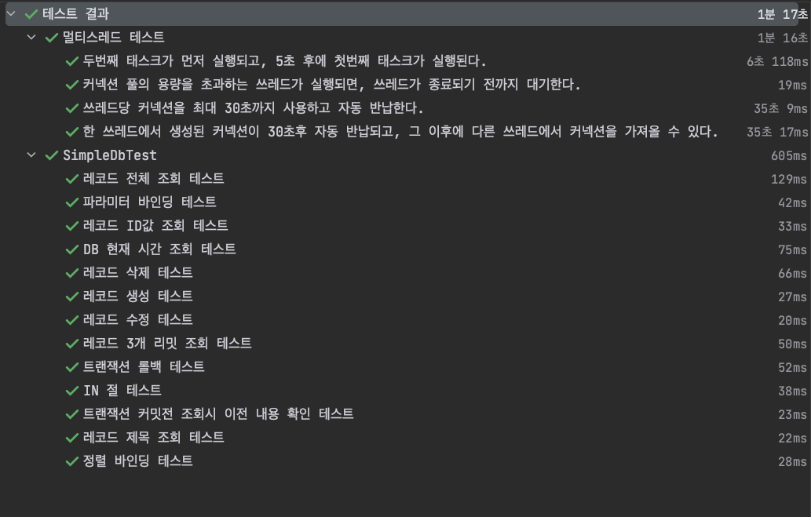

# 자바 SQL 매퍼를 직접 구현해보는 프로젝트

## 기술적 도전

[Connection, PreparedStatement 그리고 Resultset](https://waveofymymind.tistory.com/119)

[동적으로 파라미터 바인딩하기](https://waveofymymind.tistory.com/121)

[트랜잭션, ddl-auto, 커넥션 풀](https://childlike-bongo-89d.notion.site/SQL-f249a0ee18e5463b864ad6eead24c6b9)

[기능 설명에 대한 동영상](https://www.youtube.com/watch?v=asVLdraN4U8&t=21s&ab_channel=%EC%A0%84%EC%83%81%EC%A4%80)

## 검증 테스트 

